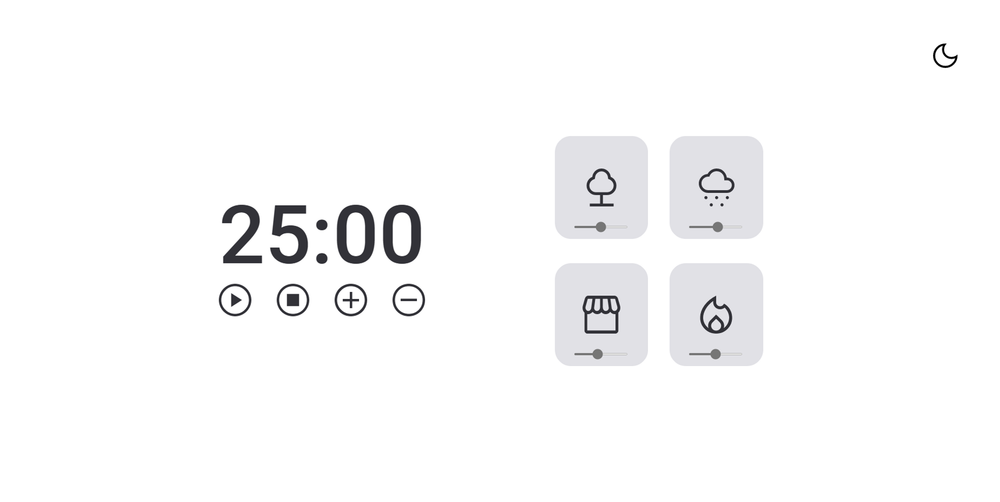

## challenge do stage 05 timer-modo-dark

#dark-mode

#light mode

## functionality

- Play   : triggers the timer;
- Stop   : para o timer;
- more + : increases by more 5 minutes o tempo do timer;
- less - : decreases in 5 minutes o tempo do timer.
- when a card is selected it changes color and starts playing the specific sound
- the volume is controlled by a slider
- dark mode button that changes the theme

